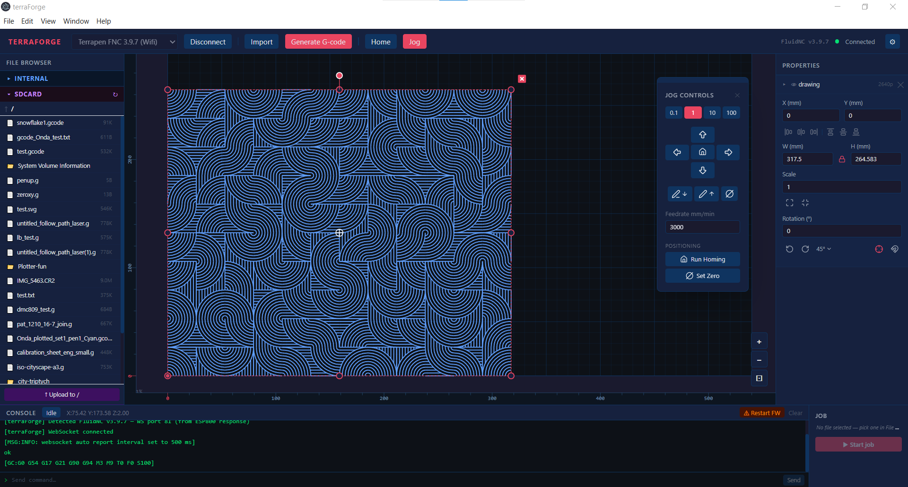

# terraForge
Plotter control and gcode generator

Claude Sonnet 4.6 Vibe Coded Electron App to control a terrapen pen plotter.

It currently allows importing an SVG (some SVGs don't import properly right now - usually paths with transforms), scaling (clunky), moving, converting to gcode, saving gcode to local machine and uploading to SD Card. It also supports previwing and plotting goode files from SD. It has jog controls.

