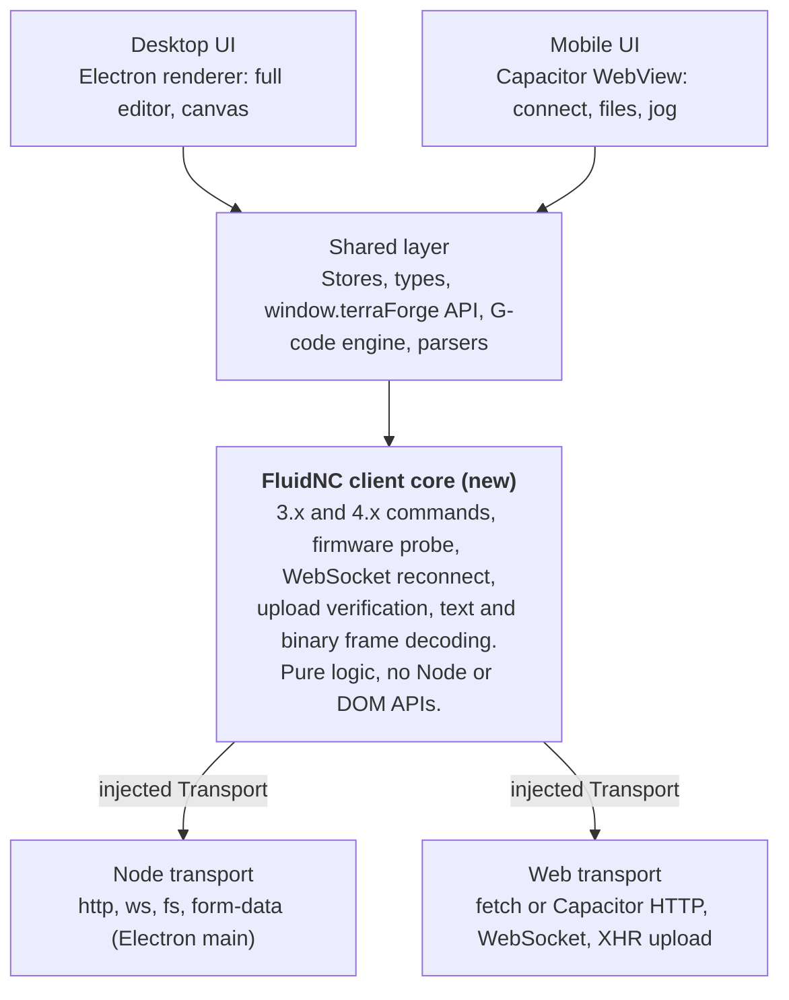

# terraForge mobile: findings and direction

_As of 2026-10-05._

## Summary

A mobile terraForge is feasible: two Android prototypes now connect to a FluidNC plotter, browse its files, jog it and show job state. The recommended next step is not more UI. It is to refactor the FluidNC client into a platform-neutral core with an injected transport, so desktop and mobile share one implementation of the protocol.

- **Prototype 1** reuses the desktop UI inside a Capacitor wrapper. It works, but the desktop panels fit a phone poorly.
- **Prototype 2** is a small mobile-first UI (Machine, Files, Jog) that keeps the theme and shares only stores and the `window.terraForge` API. It is smaller and fits phones better, but has no canvas or G-code generation.
- **Main finding:** the mobile app carries a second copy of the FluidNC client. That copy caused real bugs (blocked requests, dropped command output), and it will drift from the desktop client unless the two are merged.
- **Not yet verified:** nothing has run on a physical Android device, and a job has not yet been started from the mobile UI on real hardware.

## What we built

Both prototypes use Capacitor (Android first) and a shim in `src/mobile/` that implements the same `window.terraForge` API Electron's preload provides. The shim talks to FluidNC over HTTP and WebSocket, picks files with the system picker, saves through the share sheet, and stores machine configs in `localStorage`.

|                     | Prototype 1: desktop UI reuse                                                                      | Prototype 2: mobile-first UI                                                      |
| ------------------- | -------------------------------------------------------------------------------------------------- | --------------------------------------------------------------------------------- |
| Branch              | `feature/mobile-app` (commit d326fe1)                                                              | `experiment/mobile-first-ui` (branched from prototype 1)                          |
| UI                  | The desktop panels in a phone layout: bottom tabs, canvas sized to the bed, landscape rail, slim toolbar | New: Machine, Files, Jog screens, a status header and a pinned job bar            |
| Shared with desktop | All components, stores, G-code worker, parsers                                                     | Theme tokens, `Button`, `machineStore`, `window.terraForge` API                   |
| Can do              | Import SVG/PDF, edit layout, generate G-code, run jobs                                             | Connect, browse and manage SD/internal files, upload, jog, start/pause/resume/abort |
| Cannot do           | USB serial, touch-friendly dialogs                                                                 | No canvas, preview, import or G-code generation; one machine only                 |
| JavaScript size     | about 580 KB, plus the PDF library and G-code worker                                               | about 223 KB (71 KB gzipped)                                                      |

Other pieces added along the way:

- **Touch bridge** (prototype 1): turns drag, pinch and tap on the canvas into the mouse and wheel events the canvas already handles.
- **Config refactor:** machine-config defaults moved into `src/main/config/defaults.ts` so Electron and mobile share them.
- **Android project** (`android/`): Capacitor scaffold with cleartext HTTP enabled, because plotters speak plain HTTP on the LAN. The icons and splash images are Capacitor placeholders.
- **Vite dev proxy:** lets the mobile UI be tested in a desktop browser (see CORS below).

## What we learned

Most of the problems came from the same cause: the desktop FluidNC client runs in Node, and a phone or browser is a different environment.

1. **CORS blocked every REST call in a browser.** In Electron the HTTP calls run in the Node main process, which has no CORS. In a browser they are cross-origin, and FluidNC does not reliably send CORS headers. Symptom: "Firmware probe failed" while the WebSocket still connected. Fix for desktop-browser testing: a Vite dev proxy at `/__fluidnc/<host>/…`. The Android app uses Capacitor's native HTTP and never needs it.
2. **FluidNC sends command output as binary WebSocket frames.** Node's `ws` turns them into text. A browser delivers `Blob`s, and the first version of the mobile client ignored them. Symptom: `$$` and every other command returned "empty body", and no `[MSG:…]` or `error:` lines appeared. Fix: `binaryType = "arraybuffer"` and decode.
3. **Command results are in the reply text, not the HTTP status.** FluidNC returns `error:…` or `ALARM:…` with a 200. The mobile UI now logs each command and reply, and treats those prefixes as failures.
4. **The Start button was stricter than desktop.** It required the state to be exactly `Idle`. It now follows the desktop rule (valid G-code file, no job running), with a hint explaining why it is disabled.
5. **The mobile client is a second copy of the FluidNC client.** `src/mobile/fluidncWeb.ts` re-implements the protocol logic in `src/machine/fluidnc.ts` and reuses only the parsers. Bug 2 above came directly from this. It will also miss any future fix made to the desktop client.
6. **Reusing the desktop UI is workable but a poor fit.** The panels, dialogs and settings were designed for a large window and a mouse. The phone layout hides some of that, but the settings and G-code dialogs were never adapted.

Still unresolved when this was written: tapping Start on a real plotter (FluidNC 4.0.3 at `fluidnc397.local`) sent `$SD/Run=/snowflake1.gcode` but the job did not start. The next step is to read the console output now that the binary-frame fix is in.

## Recommended direction

Share the logic, not the screens: make the FluidNC client platform-neutral, keep one repo, and let the mobile UI diverge from the desktop UI.

The UI sits on a shared layer; the new core owns the protocol; each platform plugs in its own transport underneath.

1. **Split the FluidNC client into a core plus a transport.** The core holds everything protocol-specific: 3.x versus 4.x command conventions, the firmware and WebSocket-port probe, reconnect with a generation guard, upload target resolution and size verification, and decoding of text and binary frames. It talks to a small `Transport` interface: an HTTP request with timeout and abort, a WebSocket factory, a multipart upload, and file read/write. Electron supplies a Node implementation (`ws`, `fs`, `form-data`). Mobile supplies a web one (`fetch` or Capacitor HTTP, `WebSocket`, XHR upload).
2. **Make the shared layer explicit.** The client core, parsers, G-code engine, stores, types and the `window.terraForge` contract must not import renderer components or Electron. Either an npm workspace package or a clearly bounded folder works.
3. **Let the UIs diverge.** Desktop stays the full editor. The mobile-first UI stays task-focused (connect, files, run, jog), and gains features only when mobile needs them, such as a read-only G-code preview.
4. **Describe generator and plugin settings as data** (parameters, ranges, labels) and render forms from that, so a new generator, like the bitmap renderers now in progress, appears on both platforms without two hand-built forms.

Why this order: the protocol code is where fixes land and where the mobile prototype already went wrong, while the UI is cheap to rebuild. A fake transport also makes the protocol logic testable without a plotter.

Risk: the desktop client drives a real plotter, so the refactor must not change its behavior. Plan: do it on its own branch from `main`, keep the existing unit tests passing, add tests that run the core against a fake transport, check on real hardware before merging, then rebase the mobile branches onto it.

## Open questions and next steps

The biggest open item is that a job has not been started from the mobile UI on real hardware. Everything else listed here is either untested or a decision still to be made.

**Untested so far**

- Nothing has run on a physical Android device. No APK has been built, because the development machine has no JDK or Android SDK.
- Capacitor's native HTTP path is unexercised. All testing was in desktop Chromium, against a mock FluidNC server and, later, the real plotter through the dev proxy.
- File upload from the phone uses XHR, which needs FluidNC to accept cross-origin multipart requests. If it does not, a native upload plugin is the fix.
- Saving files (G-code, downloads) goes through the Android share sheet and has not been tried.
- Touch gestures on the canvas (prototype 1) and landscape layout for prototype 2 have not been exercised on a device.

**Decisions needed**

- Is mobile for running jobs only, or also for editing artwork? That decides how much UI is worth sharing.
- Is a read-only G-code preview needed on the phone?
- Is one machine enough, or should the desktop's exported machine list be importable?

**Next steps**

- [ ] Tap Start on the real plotter with the console visible, and read the reply (FluidNC 4.0.3 at `fluidnc397.local`).
- [ ] Decide the mobile scope above.
- [ ] Refactor the FluidNC client into a core plus `Transport` on its own branch from `main`; keep the existing tests passing and add fake-transport tests.
- [ ] Check the refactored desktop app against the real plotter before merging.
- [ ] Rebuild the mobile transport on the core and delete `src/mobile/fluidncWeb.ts`.
- [ ] Build and run an APK on a device (JDK 17+ and the Android SDK needed).
- [ ] Replace the placeholder icons and splash images, for example with `@capacitor/assets` from `build/icon.png`.
- [ ] Design schema-driven settings for generators and plugins.

## Reference

The mobile code is additive: the desktop app is unchanged apart from a few small edits listed below.

| Command                | What it does                                                                                         |
| ---------------------- | ---------------------------------------------------------------------------------------------------- |
| `npm run mobile:dev`   | Runs the mobile build in a desktop browser, with the CORS dev proxy. Use the browser's device emulation. |
| `npm run mobile:build` | Builds the web bundle into `dist-mobile/`.                                                           |
| `npm run mobile:android` | Builds, syncs and opens the Android project in Android Studio.                                     |
| `npm run mobile:apk`   | Builds a debug APK. Needs JDK 17+ and the Android SDK.                                               |

| File                                                       | Role                                                                                                  |
| ---------------------------------------------------------- | ----------------------------------------------------------------------------------------------------- |
| `src/mobile/api.ts`                                        | Implements `window.terraForge` for mobile, replacing Electron's main process and preload.             |
| `src/mobile/fluidncWeb.ts`                                 | Browser FluidNC client: the duplicate that the refactor would remove.                                 |
| `src/mobile/http.ts`                                       | HTTP layer: Capacitor native HTTP on device, `fetch` through the dev proxy in a browser, XHR for uploads. |
| `src/mobile/files.ts`, `src/mobile/persistence.ts`         | File picker and share-sheet saving; `localStorage` config.                                            |
| `src/mobile/ui/`                                           | Prototype 2: Machine, Files and Jog screens, status and job bars (`experiment/mobile-first-ui`).      |
| `src/mobile/touchBridge.ts`                                | Prototype 1: touch to mouse and wheel events for the canvas.                                          |
| `src/renderer/src/components/MobileShell.tsx`              | Prototype 1: phone layout built from desktop components.                                              |
| `vite.mobile.config.mjs`, `capacitor.config.ts`            | Mobile build config, dev proxy, Android scheme and cleartext settings.                                |
| `src/machine/fluidnc.ts`                                   | The desktop client to be split into core plus transport.                                              |

Desktop files touched by prototype 1: `App.tsx`, `Toolbar.tsx`, `Toolbar/MachineSelector.tsx`, `PlotCanvas.tsx` (one data attribute), `types/index.ts`, and the new `main/config/defaults.ts`. All 1,587 existing tests pass on both branches.
