# terraForge — User Guide

> **Version:** 1.2 · **Date:** 2026-04-22
> This guide covers all currently implemented features of terraForge.

---

## Table of Contents

1. [What is terraForge?](#1-what-is-terraforge)
2. [Application Layout](#2-application-layout)
3. [First-Time Setup — Machine Configuration](#3-first-time-setup--machine-configuration)
4. [Connecting to Your Machine](#4-connecting-to-your-machine)
5. [Importing Files](#5-importing-files)
6. [Working on the Canvas](#6-working-on-the-canvas)
7. [The Properties Panel](#7-the-properties-panel)
8. [Layer Groups](#8-layer-groups)
9. [Generating G-code](#9-generating-g-code)
10. [The File Browser](#10-the-file-browser)
11. [Running a Job](#11-running-a-job)
12. [Jog Controls](#12-jog-controls)
13. [Console & Alarm Handling](#13-console--alarm-handling)
14. [Background Tasks](#14-background-tasks)
15. [Layout Management & Page Templates](#15-layout-management--page-templates)
16. [Keyboard Shortcuts](#16-keyboard-shortcuts)
17. [Troubleshooting](#17-troubleshooting)

---

## 1. What is terraForge?

terraForge is a desktop application for controlling FluidNC-based pen plotters — especially the **TerraPen**. It lets you:

- Import **SVG** and **PDF** artwork and position it on the machine bed
- Convert SVG/PDF paths to G-code, with optional path optimisation to minimise pen travel
- Preview G-code toolpaths on the canvas before plotting
- Import G-code files from your computer and run them directly
- Upload files to and manage your machine's SD card (internal flash and SD card)
- Start, pause, resume, and abort jobs
- Jog the machine and send raw commands via the console
- Organise imports into **layer groups** for multi-pen plotting
- **Undo/redo** and **copy/paste** canvas objects
- **Save and reopen layouts** (.tforge files)
- **Page template overlays** for print-size artwork
- Toggle between **dark and light themes**

terraForge communicates with FluidNC over **Wi-Fi (WebSocket + HTTP REST)** or **USB serial**. The WebSocket connection auto-reconnects with exponential back-off if the link drops.

---

## 2. Application Layout

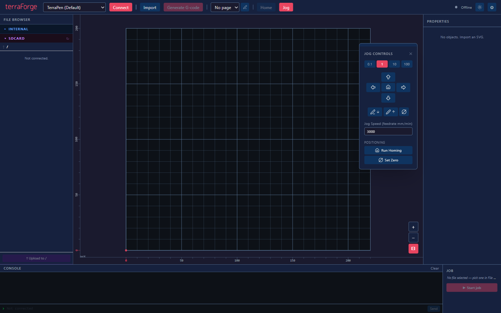

### Panel Summary

| Area                   | Location         | Purpose                                              |
| ---------------------- | ---------------- | ---------------------------------------------------- |
| **Toolbar**            | Top              | Connect, import, generate, home, jog, settings       |
| **File Browser**       | Left (240 px)    | Browse FluidNC internal filesystem and SD card       |
| **Canvas**             | Centre           | Visualise the bed, SVG imports, and G-code toolpaths |
| **Properties**         | Right (256 px)   | Position, scale, and manage imported objects         |
| **Console**            | Bottom-left      | Real-time FluidNC output; send raw commands          |
| **Job**                | Bottom-right     | Start/pause/resume/abort; job progress bar           |
| **Notification stack** | Canvas top-right | Background task progress and notifications           |

---

## 3. First-Time Setup — Machine Configuration

Before you can connect, you need to create at least one **machine configuration profile**.

### Opening the Settings Dialog

Click the **⚙** (gear) button at the far right of the toolbar.

### Creating Your First Profile

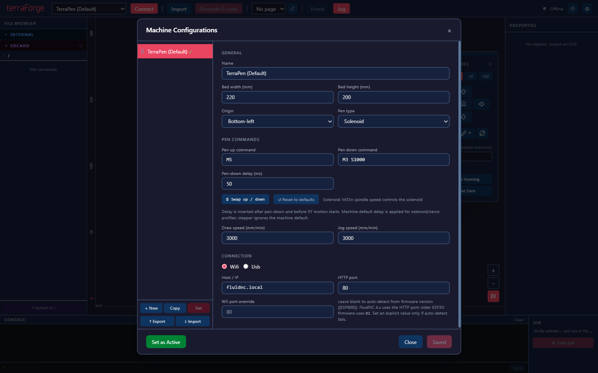

1. Click **+ New** in the sidebar.
2. Fill in the **General** section:

   | Field               | Description                       | Example       |
   | ------------------- | --------------------------------- | ------------- |
   | **Name**            | Display name for this machine     | `TerraPen`    |
   | **Bed width (mm)**  | Plottable X range                 | `220`         |
   | **Bed height (mm)** | Plottable Y range                 | `200`         |
   | **Origin**          | Where the machine home is         | `Bottom-left` |
   | **Pen type**        | Controls the pen-up/down commands | `Solenoid`    |

3. **Origin options:**

   | Origin         | Description                                          |
   | -------------- | ---------------------------------------------------- |
   | `Bottom-left`  | (0,0) at bottom-left — most common FluidNC default   |
   | `Top-left`     | (0,0) at top-left — some laser spindle setups        |
   | `Bottom-right` | (0,0) at bottom-right                                |
   | `Top-right`    | (0,0) at top-right                                   |
   | `Center`       | (0,0) at centre; bed coordinates run from −½W to +½W |

4. **Pen type** automatically fills in sensible defaults for the pen commands:

   | Pen Type | Pen Up  | Pen Down | Pen-down Delay |
   | -------- | ------- | -------- | -------------- |
   | Solenoid | `M3S0`  | `M3S1`   | `50 ms`        |
   | Servo    | `G0Z15` | `G0Z0`   | `0 ms`         |
   | Stepper  | `G0Z15` | `G0Z0`   | `0 ms`         |

   Use the **⇕ Swap** button if your solenoid wiring is reversed. Use **↺ Reset** to restore type defaults after manual edits.

   The **Pen-down delay (ms)** field controls dwell time inserted after pen-down and before XY drawing starts.

5. Set your default speeds:
   - **Draw speed (mm/min)**: default plotting feedrate for generated G-code.
   - **Jog speed (mm/min)**: default speed used by jog moves.

6. Fill in the **Connection** section (see connection details in §4).

7. Click **Save Changes**.

8. Click **Set as Active** to make this the working machine.

9. Click **Close**.

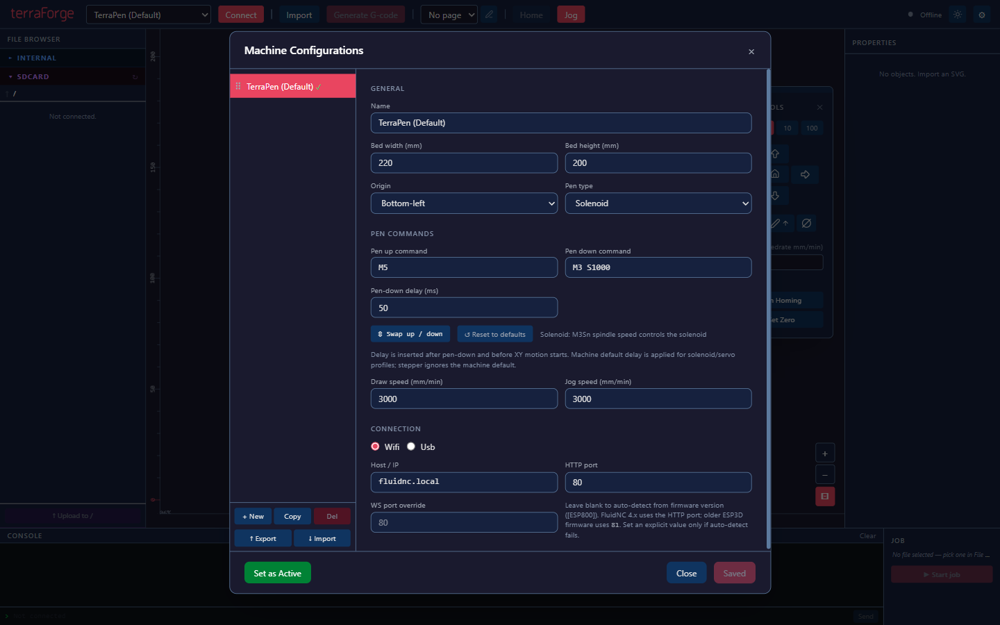

### Managing Multiple Profiles

- **Copy** — duplicates the selected profile (useful for machines that share the same bed size but differ in connection type).
- **Del** — deletes the selected profile. Disabled while connected.
- **Drag handle (⠿)** — drag rows up/down to reorder the list.
- **↑ Export** — saves all profiles to a `.json` file for backup or sharing.
- **↓ Import** — merges profiles from a `.json` file; duplicates (by ID or name) are skipped.

> **Note:** You cannot edit the **active** profile while the machine is connected. A 🔒 banner appears and all fields become read-only. Non-active profiles can be edited at any time.

---

## 4. Connecting to Your Machine

### Wi-Fi Connection

1. Ensure your FluidNC controller is on the same network as your computer.
2. Select your machine profile from the **Machine** dropdown in the toolbar (disabled while connected).
3. In the Machine Config dialog's **Connection** section:
   - Set type to **Wi-Fi**
   - Enter the **Host / IP** (e.g. `fluidnc.local` or `192.168.1.50`)
   - Leave **HTTP port** as `80` unless your setup differs
   - **WS port override** — leave blank for FluidNC 4.x (auto-detected). Enter `81` only for older ESP3D-based firmware
4. Click **Connect** in the toolbar.

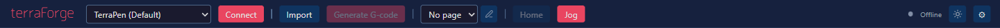

The connection status indicator (top-right of toolbar) shows:

| Indicator                        | Meaning                                |
| -------------------------------- | -------------------------------------- |
| ⚫ Grey dot + "Offline"          | Not connected                          |
| 🟢 Green dot + "Connected"       | Connected, WebSocket live              |
| 🟡 Amber pulsing + "Connecting…" | Connected but WebSocket not yet active |

If connection fails, a red error notification appears with the error message.

### USB Serial Connection

1. Set the connection type to **USB** in the Machine Config dialog.
2. Select the serial port from the dropdown (auto-populated from available ports), or type the path manually (e.g. `COM3` on Windows, `/dev/ttyUSB0` on Linux).
3. The baud rate is fixed at **115200** (FluidNC standard).
4. Click **Connect**.

### Disconnecting

Click **Disconnect** in the toolbar. The machine selector and config editing are re-enabled immediately.

---

## 5. Importing Files

### Importing SVG Files

#### Supported Elements

terraForge converts these SVG elements to plottable paths at import time:

| Element      | Notes                                                       |
| ------------ | ----------------------------------------------------------- |
| `<path>`     | Full command set: M L H V C S Q T A Z (absolute + relative) |
| `<rect>`     | Rounded corners (`rx`/`ry`) supported                       |
| `<circle>`   |                                                             |
| `<ellipse>`  |                                                             |
| `<line>`     |                                                             |
| `<polyline>` |                                                             |
| `<polygon>`  | Auto-closed                                                 |

#### How to Import

Click **Import SVG** in the toolbar. A file dialog opens filtered to `.svg` files. Select your file.

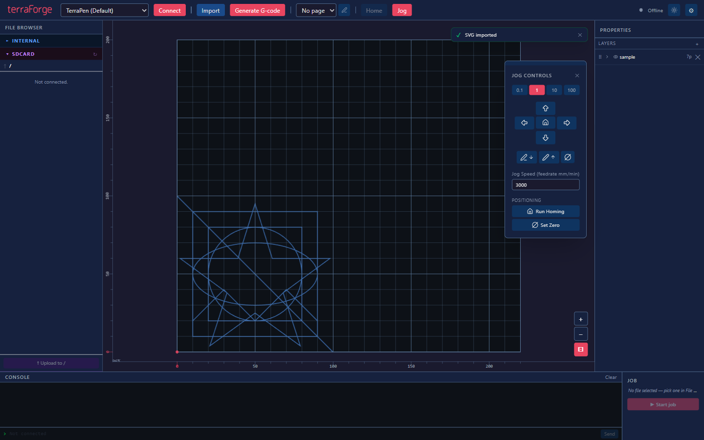

terraForge:

1. Reads the SVG's physical size (`width`/`height` attributes with units: `mm`, `cm`, `in`, `pt`, `pc`, `px`). The import appears at **correct real-world scale** by default.
2. Resolves all `transform` attributes (including Inkscape layer matrices) and bakes them into absolute path coordinates.
3. Normalises path coordinates so the object's origin is at its top-left corner.
4. **Detects sub-layers** — `<g>` elements with an explicit `display` style (e.g. Inkscape layers) become collapsible sub-layers in the Properties panel. Their initial visibility matches the source SVG.
5. Displays the import at position (0, 0) on the bed (bottom-left corner).
6. Shows a notification message on completion.

#### Physical Size Handling

| SVG unit        | Conversion           |
| --------------- | -------------------- |
| `mm`            | Direct (exact)       |
| `cm`            | × 10                 |
| `in`            | × 25.4               |
| `pt`            | × 25.4 / 72          |
| `pc`            | × 25.4 / 6           |
| `px` / unitless | × 25.4 / 96 (96 DPI) |

If the SVG has no physical units, 1 SVG user unit = 1 mm.

---

### Importing PDF Files

Click **Import PDF** in the toolbar. A dialog opens filtered to `.pdf` files.

terraForge extracts vector paths from each page using the page’s PDF operator list. Supported operators: moveTo, lineTo, curveTo (all three PDF curve variants), closePath, and rectangle.

**What gets imported:**

- Vector art, technical drawings, paths created by Inkscape, Illustrator, etc.
- Each page with vector content becomes a separate import named `filename_p1`, `filename_p2`, …
- Pages with no vector content are silently skipped
- Raster images embedded in the PDF are ignored

**Scale:** PDF coordinates are in points. terraForge applies `25.4 ÷ 72 ≈ 0.353 mm/pt` so the imported paths appear at their correct real-world physical size.

### Importing G-code Files

Click **Import G-code** in the toolbar. A dialog opens filtered to all recognised G-code extensions (`.gcode`, `.nc`, `.g`, `.gc`, `.gco`, `.ngc`, `.ncc`, `.cnc`, `.tap`). The file is read from your local disk, parsed, and displayed as a toolpath overlay on the canvas. It is automatically queued as the job file (labelled 🖥 with “(local — will upload)”). When you click **Start job**, terraForge uploads it to the SD card root first, then runs it.

---

## 6. Working on the Canvas

### Canvas Overview

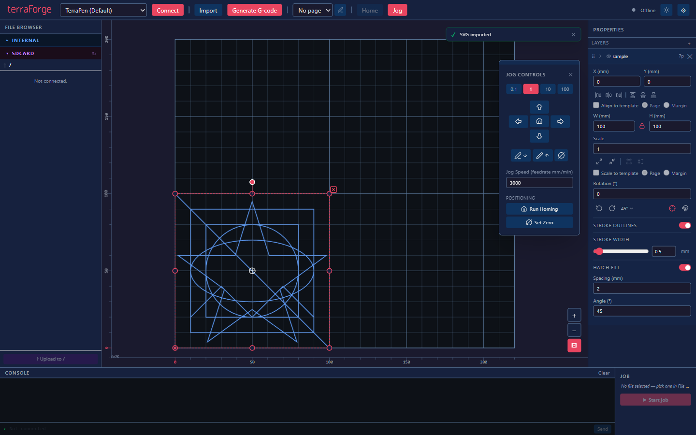

The canvas shows:

- **Bed grid** — 10 mm minor lines, 50 mm major lines
- **Origin marker** — red dot at (0, 0) in machine coordinates
- **Rulers** — X ruler (bottom edge for bottom-left origin, top edge for top-left), Y ruler (left edge); adaptive tick density; origin labelled in red
- **Imported objects** — shown in blue; selected object shown in brighter blue with a red dashed bounding box
- **G-code toolpath overlay** — rapids in dashed grey, cuts in solid blue

### Dark / Light Theme

Click the **🌙 / ☀️** (Moon / Sun) button at the right end of the toolbar to toggle between dark and light themes. The preference is remembered across sessions.

### Zoom and Pan

| Action                           | Effect                          |
| -------------------------------- | ------------------------------- |
| **Mouse wheel**                  | Zoom in / out centred on cursor |
| **Ctrl+Shift++**                 | Zoom in                         |
| **Ctrl+Shift+−**                 | Zoom out                        |
| **Middle-mouse drag**            | Pan                             |
| **Space + left-drag**            | Pan (Space-to-pan mode)         |
| **⊡ button** (canvas overlay)    | Fit bed to viewport (Ctrl+0)    |
| **+/− buttons** (canvas overlay) | Zoom in / out                   |

The **zoom % badge** (bottom-left of canvas) shows the current zoom level.

The **⊡ (fit to view)** button highlights red when the view is actively fitted. The bed re-fits automatically on window resize while in fitted mode.

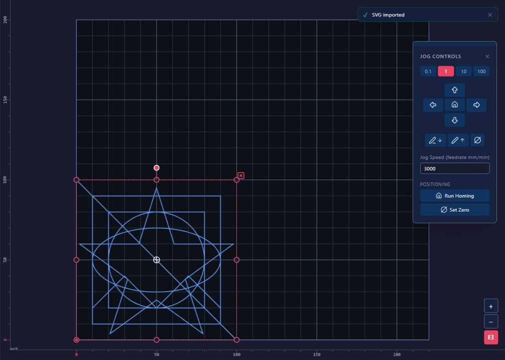

### Moving an Object

Click and drag any part of an imported SVG to move it. The object is clamped so its far edge cannot leave the bed boundary.

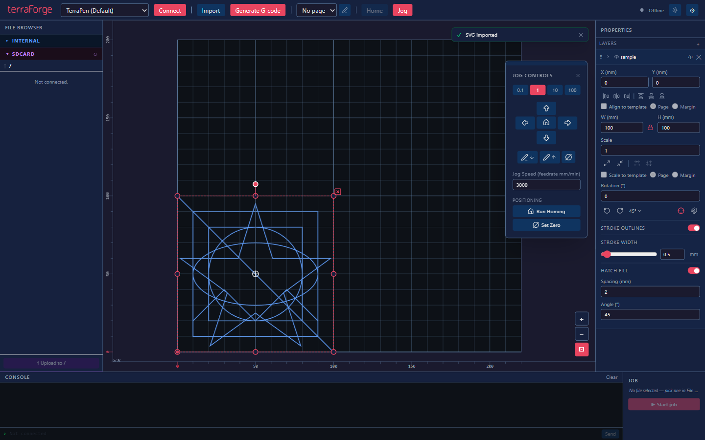

### Scaling an Object

Click an object to select it. Eight **circular handles** appear at the corners and midpoints of the bounding box. Drag any handle to scale uniformly. Scaling is clamped to the bed boundary.

Cursor changes match the handle position:

| Handle                   | Cursor            |
| ------------------------ | ----------------- |
| Corners (tl, tr, bl, br) | Diagonal resize   |
| Midpoints (t, b)         | Vertical resize   |
| Midpoints (l, r)         | Horizontal resize |

### Rotating an Object

A **rotation handle** (filled circle) appears above the top-centre of the bounding box when an object is selected. Drag it to rotate freely. The bounding box and all eight scale handles track the rotation.

For precise angles, use the **Rotation** numeric input in the Properties panel. Rotation snaps automatically to 0° / 45° / 90° / 135° / 180° / 225° / 270° / 315° when within 3° of a preset.

### Deleting an Object

Select the object and press **Delete** or **Backspace**, or click the **✕** button that appears near the top-right corner of the selected object's bounding box.

### Deselecting

Press **Escape**, or click an empty area of the canvas.

### Selecting Multiple Objects

Press **Ctrl+A** to select all imports simultaneously. All objects show grouped bounding boxes and can be moved, scaled, or rotated together around the group centroid. Press **Ctrl+A** again to cycle: all selected → first single selected → all. Press **Escape** to deselect everything.

### Undo and Redo

terraForge maintains up to **50 undo steps** for canvas changes (move, scale, rotate, delete, paste). Each gesture that produces a real change is recorded as one step; trivial clicks are not.

| Shortcut         | Action                  |
| ---------------- | ----------------------- |
| **Ctrl+Z**       | Undo last canvas change |
| **Ctrl+Shift+Z** | Redo                    |

### Copy, Cut, and Paste

| Shortcut   | Action                                                                 |
| ---------- | ---------------------------------------------------------------------- |
| **Ctrl+C** | Copy selected import (stays on canvas)                                 |
| **Ctrl+X** | Cut (copy and remove from canvas)                                      |
| **Ctrl+V** | Paste — creates a positionally-offset clone with an auto-numbered name |

Pasted objects get names like `logo copy`, `logo copy (2)`, etc.

### G-code Toolpath on Canvas

When a G-code file is loaded for preview (from the File Browser or Import G-code):

- **Grey dashed lines** = rapid moves (pen up)
- **Blue solid lines** = cut moves (pen down)

Click the toolpath to select it. A blue dashed bounding box appears. Press **Delete** or click the **✕** button on the toolpath to remove the preview.

### Live Plot Progress

During an active job, the canvas shows a real-time progress overlay on top of the toolpath:

- **Red lines** — cut moves the machine has already completed
- **Orange lines** — rapid moves already traversed

The overlay tracks the machine’s reported work position, projecting it onto the nearest G-code segment so the trace stays on the correct path even with sparse position updates.

### Pen Position Crosshair

A green **✛ crosshair** tracks the machine’s current work position on the canvas whenever a connection is active — even when no job is running. It is WCO-corrected (work-coordinate offset applied) and renders at a fixed screen size so it stays visible at any zoom level.

---

## 7. The Properties Panel

The Properties panel (right side) lists all imported SVG objects and, when a toolpath is loaded, also shows G-code details.

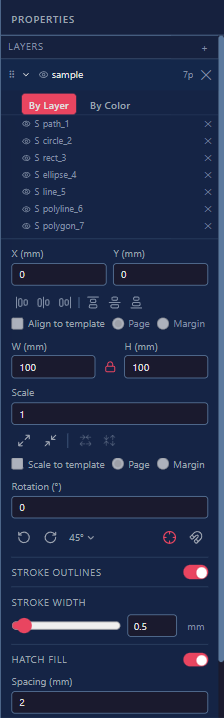

### Import Row

Each import shows:

- 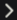 /  — expand/collapse the path list
-  /  — toggle visibility (hidden imports are excluded from G-code)
- **Name** — double-click to rename inline (Enter to confirm, Escape to cancel). The name is used as the G-code save filename.
- **Np** — path count
- **✕** — delete the entire import

### Numeric Fields (when selected)

Click an import row to select it and reveal the numeric editors:

| Field        | Description                                      |
| ------------ | ------------------------------------------------ |
| **X (mm)**   | Horizontal position of the import’s left edge    |
| **Y (mm)**   | Vertical position of the import’s bottom edge    |
| **W (mm)**   | Width in mm; changing width recalculates scale   |
| **H (mm)**   | Height in mm; changing height recalculates scale |
| **Scale**    | Uniform scale factor (1 = 100%)                  |
| **Rotation** | Angle in degrees; type or use CCW/CW buttons     |

All position/size fields clamp to the bed boundary automatically.

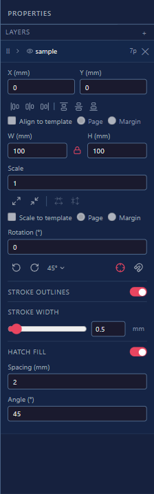

### Alignment Controls

The alignment icon row (left/center/right and top/center/bottom) aligns the selected import within a chosen frame:

- **Bed (default):** aligns to the full machine bed extents.
- **Template mode:** enable **Align to template** to switch alignment to the active page template.
- **Page / Margin target:** choose **Page** to align to the page rectangle, or **Margin** to align to the inset printable rectangle.

If no page template is selected, **Align to template** is disabled and alignment stays bed-based.

### Aspect Ratio Lock

The **🔒 padlock** icon between the W and H fields controls aspect ratio:

- **Locked (default):** W and H change together via a shared scale factor. Drag handles also maintain the ratio.
- **Unlocked:** W and H can be set independently, storing separate `scaleX` / `scaleY` values. Drag handles restore uniform scale when you next resize.

### Scale Shortcuts

Four transform buttons appear below the Scale input:

- **⊞ Fit to bed / Fit to page / Fit to margin** — scales the import as large as possible while keeping it in bounds. The target is bed by default, or page/margin when template scaling is enabled.
- **⊟ 1:1 reset** — restores scale to 1 (1 SVG user unit = 1 mm) and re-enables ratio lock.
- **Fit horizontal scale** — fits width only to the current target frame.
- **Fit vertical scale** — fits height only to the current target frame.

Horizontal/vertical fit buttons are disabled while aspect ratio lock is enabled.

Use **Scale to template** to switch fit actions from bed to the active page template, then choose **Page** or **Margin** as the fit target. If no page template is active, template scaling controls are disabled.

### Rotation Controls

| Control              | Action                                                             |
| -------------------- | ------------------------------------------------------------------ |
| **Angle input**      | Type any value; press Enter or click away to apply                 |
| **CCW / CW buttons** | Rotate counter-clockwise / clockwise by the configured step amount |
| **Step flyout**      | Click the step label to choose ±5° / ±15° / ±45°                   |
| **Snap**             | Rotation snaps to 0°/45°/90°…315° when within 3° of a preset       |

### Stroke Width

The **Stroke width** field sets the canvas preview stroke thickness in mm. This affects how thick paths appear on screen only — it does **not** change G-code output. When the import belongs to a layer group, the new stroke width is applied to all other imports in that group automatically.

### Centre Marker

Ticking **Centre marker** displays a crosshair (+) at the geometric centre of the selected import. The marker renders at a constant screen size at all zoom levels.

### Stroke Outlines

The **Stroke outlines** section controls whether path outlines are plotted for the selected import.

| Toggle                                  | Description                                                                                                                                                                 |
| --------------------------------------- | --------------------------------------------------------------------------------------------------------------------------------------------------------------------------- |
| **Stroke outlines**                     | Master toggle — when off, no stroke paths from this import are included in G-code output. Useful for imports you want to plot as hatch-fill only.                           |
| **Generate stroke for no-stroke paths** | Only shown when the import contains paths that have no source stroke (fill-only shapes). When on, synthetic outlines are generated along the path boundary so they can be plotted. Generated outlines appear in the colour groups view and count towards per-colour export. |

> **Note:** "Generate stroke for no-stroke paths" is hidden when all paths already carry a stroke colour. It appears automatically once a fill-only path is detected.

### Hatch Fill

Hatch fill generates evenly-spaced parallel lines across closed filled shapes — useful when the pen can only draw strokes and you want to shade an area.

| Field       | Description                                                  |
| ----------- | ------------------------------------------------------------ |
| **Enable**  | Checkbox — generates hatch lines and includes them in G-code |
| **Spacing** | Distance between hatch lines (mm, default 2 mm)              |
| **Angle**   | Angle of hatch lines in degrees (default 45°)                |

Hatch lines are regenerated automatically when you scale the import so physical spacing is always preserved.

### G-code Toolpath Properties

When a G-code toolpath is selected on the canvas (loaded from the File Browser or via Import G-code), the Properties panel shows:

| Field             | Description                                                                               |
| ----------------- | ----------------------------------------------------------------------------------------- |
| **Filename**      | Source file name                                                                          |
| **Size**          | File size (B / KB / MB)                                                                   |
| **Lines**         | Total G-code line count                                                                   |
| **Feedrate**      | First `F` command in the file (mm/min)                                                    |
| **Est. duration** | Estimated plot time (path length ÷ feedrate) — shown as `15 s`, `3 m 45 s`, or `1 h 22 m` |

### Per-Path Controls

Expand an import () to see its paths. The view adapts depending on whether the source SVG contained detectable sub-layers:

#### Layered view (SVG had sub-layers)

Paths are organised under their source layer. Each **layer row** shows:

-  /  — expand/collapse the paths within that layer (collapsed by default)
-  /  — toggle visibility for **all paths in the layer**. Layers that were hidden in the source SVG start in the hidden state.
- **Name** — the layer label (from `inkscape:label`, the element `id`, or a positional fallback)
- **Np** — number of paths in the layer

Expand a layer row to see its individual paths. For each path:

-  /  — show/hide this path independently of its layer
- **Name** — path label or short id
- **✕** — remove only this path from the import

Paths that do not belong to any detected layer are listed below the layer rows.

#### Flat view (no sub-layers detected)

All paths are listed directly. For each path:

-  /  — show/hide the path. Hidden paths are excluded from G-code.
- **Name** — label from the SVG, or a short UUID
- **✕** — remove only this path from the import

Layer (and path) visibility is respected when generating G-code — hidden layers and hidden paths are excluded automatically.

---

## 8. Layer Groups

Layer groups organise imports by pen — ideal for multi-pen or multi-colour plots where each pen traces a different set of paths.

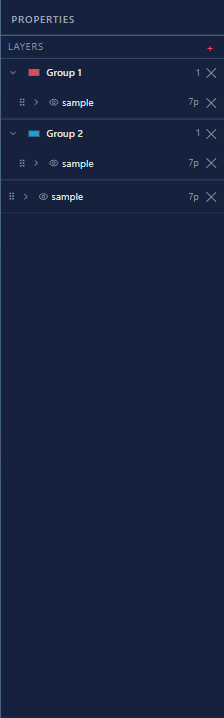

### Creating a Group

Click **+ Add group** at the bottom of the Properties panel sidebar. A new group appears with a default name and colour.

### Renaming and Colour

Click the group name to edit it inline. Click the colour swatch to choose a new colour. The colour is used as the stroke tint for all member imports on the canvas.

### Assigning Imports to a Group

Drag any import row from the ungrouped list into a group header. Drag it back out to ungroup it.

### Group Selection and Transforms

Click a group header row to select the entire group. Drag, scale, and rotate operations apply to all members simultaneously, transforming around the group centroid.

### Colour Groups

In addition to manual layer groups, terraForge automatically builds **colour groups** from SVG path colours.

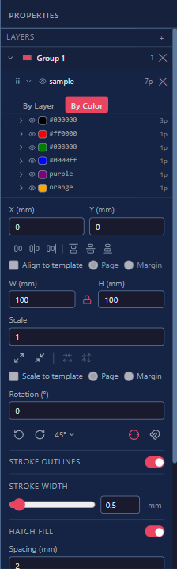

- Groups are based on effective path fill/stroke colour.
- Each colour group appears as a collapsible row in the Properties panel with a colour swatch and path count.
- Toggle a colour group's visibility to include/exclude all paths in that group from generation.
- Paths are sorted in hue order (rainbow order) to make colour-based workflows easier to scan.

Colour grouping is useful for pen-swap workflows where each pen corresponds to one source artwork colour.

### Generating G-code Per Group

When layer groups are defined, you can generate a separate G-code file for each group from the G-code options dialog. Each file is named after the group (e.g. `red_layer.gcode`, `blue_layer.gcode`). Imports not assigned to any group are collected into a single additional file named `ungrouped.gcode`.

---

## 9. Generating G-code

### The G-code Options Dialog

1. Import one or more SVGs and position them on the bed.
2. Click **Generate G-code** in the toolbar.
3. The dialog opens with three collapsible sections: **Paths**, **Options**, and **Output**.

#### Paths section

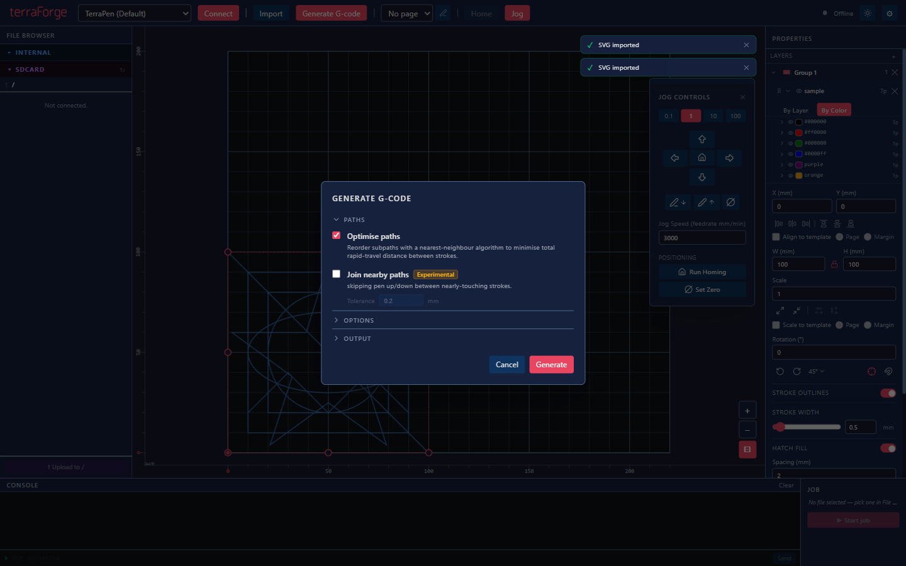

| Option                | Description                                                                |
| --------------------- | -------------------------------------------------------------------------- |
| **Optimise paths**    | Nearest-neighbour reorder of all sub-paths to minimise total rapid travel  |
| **Join nearby paths** | (Experimental) Merge path endpoints within the tolerance to skip pen lifts |

When **Join nearby paths** is enabled, a **Tolerance** field appears (default 0.2 mm). Consecutive sub-paths whose endpoint-to-start-point gap is within this tolerance are merged, eliminating the pen-up / rapid / pen-down cycle between nearly-touching strokes.

#### Options section

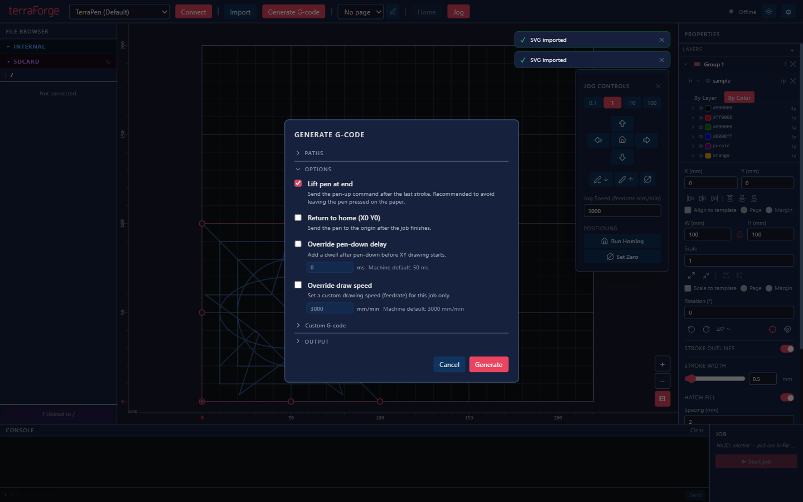

| Option                      | Description                                                                            |
| --------------------------- | -------------------------------------------------------------------------------------- |
| **Lift pen at end**         | Send the pen-up command after the last stroke (recommended)                            |
| **Return to home**          | Rapid to origin (X0 Y0) after the job finishes                                         |
| **Override pen-down delay** | Apply a per-job pen-down delay override (ms). Shows machine default next to the input. |
| **Override draw speed**     | Apply a per-job drawing speed (feedrate) override in mm/min.                           |
| **Page clipping**           | Clip G-code to the page/margin boundary (only shown when a page template is active)    |
| **Custom G-code**           | Sub-collapsible for custom start/end G-code blocks inserted around the job             |

#### Output section

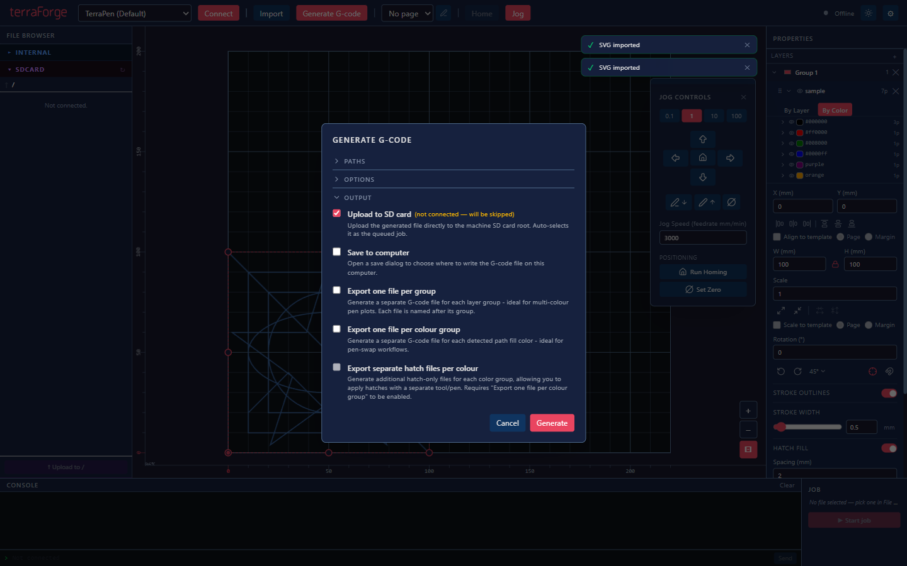
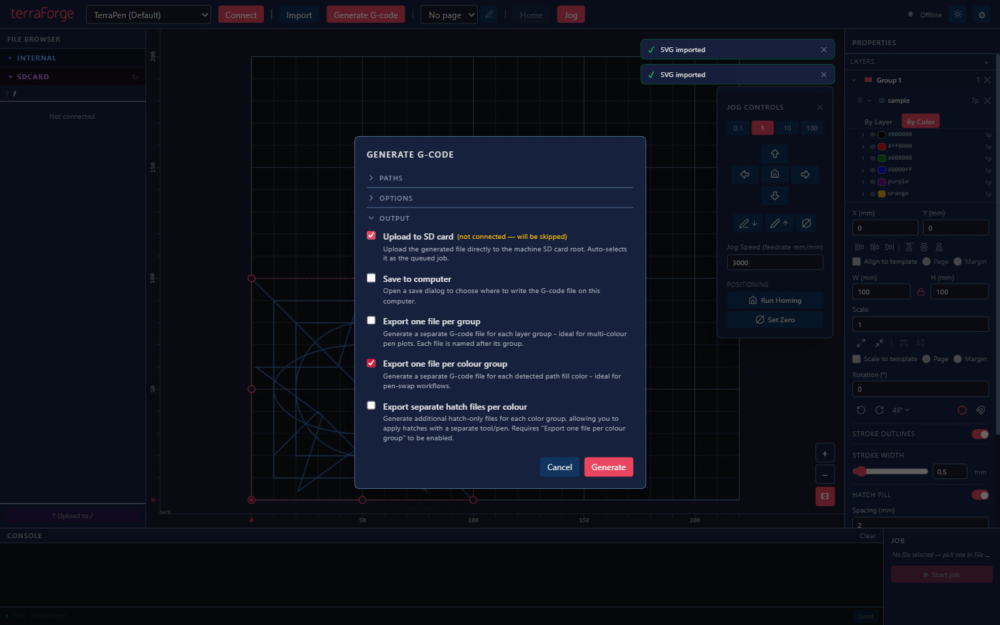

| Option                                     | Description                                                                              |
| ------------------------------------------ | ---------------------------------------------------------------------------------------- |
| **Upload to SD card**                      | Upload the generated file to the machine SD card root after generation                   |
| **Save to computer**                       | Open a native save dialog after generation                                               |
| **Export one file per group**              | Generate a separate G-code file for each layer group (multi-colour pen plots)            |
| **Export one file per colour group**       | Generate a separate G-code file for each detected path colour group.                     |
| **Export separate hatch files per colour** | Generate additional hatch-only files for each colour group (requires per-colour export). |

- At least one output (**Upload** or **Save**) must be selected; the **Generate** button is disabled otherwise.
- When **Upload to SD card** is selected and a machine is connected, the uploaded file is automatically selected as the queued job — **Start job** is immediately ready.
- When not connected, the upload option shows _"(not connected — will be skipped)"_ but remains selectable to pre-configure your preference.

### Persisted Preferences

G-code dialog preferences are saved in `localStorage` and restored on the next session, including join tolerance, pen-down delay override, draw speed override, and output targets.

Defaults: Optimise = on, Join paths = off (0.2 mm), Lift pen at end = on, Return to home = off, Override pen-down delay = off, Override draw speed = off, Upload to SD = on, Save to computer = off, Export per group = off, Export per colour group = off, Export hatch per colour = off.

### Path Optimisation

When **Optimise paths** is enabled:

1. All visible sub-paths from all imports are collected into a single pool.
2. They are reordered greedily (nearest-neighbour from the current pen position) to minimise total rapid travel.
3. Output is a flat sequence — no per-object grouping.

Optimised filenames append `_opt`: `logo_opt.gcode`, `logo+2_opt.gcode`.

### Save Filename

For single-file export, the default filename base is chosen in this order:

- Selected layer group name (if a group is selected)
- Selected import name (if an import is selected)
- First import name

The name is sanitised for filesystem-safe output, and `_opt` is appended when optimisation is enabled.

For per-group export, each file is named from the group name, and unassigned imports export as `ungrouped.gcode`.

For per-colour export, files are generated per detected colour group using a colour-based filename (for example, `color_hex-ff0000.gcode`), with `_opt` appended when optimisation is enabled.

### G-code Header

Every generated file includes a header comment with machine name, bed dimensions, origin setting, optimisation flags, and a generation timestamp.

### Cancelling Generation

While generation is running, a progress notification appears. Click the **✕** on the notification to cancel. The worker stops immediately.

---

## 10. The File Browser

The left panel contains two collapsible sections: **INTERNAL** (FluidNC internal flash) and **SDCARD** (SD card). Each section can be independently expanded or collapsed.

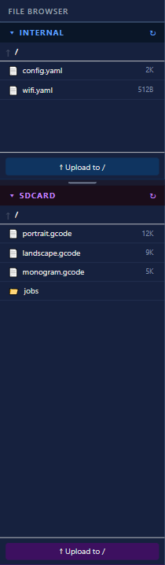

### Navigation

- **Click a folder** to enter it.
- **↑ button** — go up one directory level.
- **Breadcrumb links** — click any segment to jump directly to that path.
- **↻ button** — refresh the current directory listing.

### File Operations

For each file in the listing:

| Control                      | Action                                                           |
| ---------------------------- | ---------------------------------------------------------------- |
| **Click file row**           | Select as queued job (highlighted blue); click again to deselect |
| **▶ button**                 | Run the file on the machine immediately                          |
| **🔍 button** (G-code files) | Load toolpath preview onto the canvas                            |
| **↓ button**                 | Download file to local disk                                      |
| **✕ button**                 | Delete file from the machine                                     |

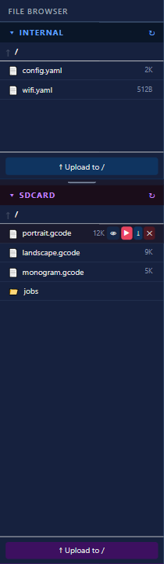

**Download dialogs:**

- `.gcode` / `.nc` / `.g` / `.gc` / `.gco` / `.ngc` / `.ncc` / `.cnc` / `.tap` → filtered save dialog
- All other file types → unfiltered save dialog

### Uploading Files

Click the **↑ Upload** button in a section header to open a native file dialog (unrestricted file types). The file is uploaded to the current directory. The listing refreshes automatically after upload.

Upload progress is shown in the notification stack. Uploads can be cancelled via the notification's ✕ button.

**Auto-refresh:** The file listing refreshes automatically after an upload, and also whenever FluidNC emits a `[MSG:Files changed]` console message.

### Importing G-code from Your Computer

See [§5 Importing Files](#5-importing-files) for details on importing G-code from your local disk.

---

## 11. Running a Job

The **Job** section lives at the right side of the bottom panel.

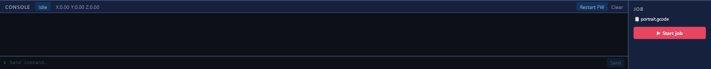

### Selecting a Job File

Pick a file in the File Browser (click its row to highlight it blue). The Job panel shows the filename.

Accepted extensions: `.gcode` `.nc` `.g` `.gc` `.gco` `.ngc` `.ncc` `.cnc` `.tap`

A warning appears if the selected file is not a recognised G-code extension.

### Starting a Job

Click **▶ Start job**. Button is disabled unless a valid G-code file is selected and the machine is connected.

- **SD card file** — runs immediately via the FluidNC `/run` endpoint.
- **Local file (🖥)** — uploads to the SD card root first, then runs. Upload progress is shown in the notification stack.

### During a Job

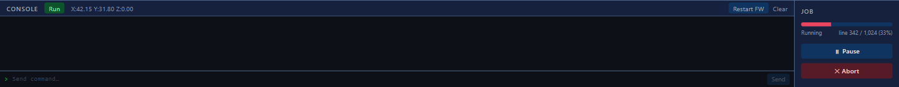

| Control      | Action                                                     |
| ------------ | ---------------------------------------------------------- |
| **⏸ Pause**  | Sends FluidNC hold command                                 |
| **▶ Resume** | Sends FluidNC resume command (visible only when paused)    |
| **✕ Abort**  | Prompts for confirmation, then sends FluidNC abort command |

**Progress bar:**

- Shows `line N / total (%)` when FluidNC reports line numbers.
- Shows an indeterminate animation when line count is not yet available.
- Labels show **Running** or **Paused** state.

### After a Job

The progress bar disappears. The machine returns to **Idle** state (visible in the console header). The file remains selected so you can re-run without re-selecting.

---

## 12. Jog Controls

Click **Jog** in the toolbar to open the jog panel. The panel floats as an overlay and can be **dragged anywhere on screen** by its grey drag handle at the top.

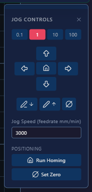

### Step Size

Select a step increment: **0.1 / 1 / 10 / 100** mm. The active step is highlighted red.

### Postion

- **▲▼◄►** — jog the corresponding axis by the selected step.
- **⌂** — rapid move to origin (G0 X0 Y0).

### Pen

**Pen Up** and **Pen Down** buttons jog the pen axis by the selected step.

- **Solenoid pen type:** Z+ sends the configured `penUpCommand`; Z− sends `penDownCommand`.
- **Servo / Stepper pen type:** Uses incremental jog commands (`$J=G91 G21 Z±dist F{feedrate}`).

### Feedrate

The **Feedrate mm/min** input controls the speed for all jog moves. Default is 3000 mm/min.

### Homing

Click **Home ($H)** in the jog panel (or the **Home** button in the main toolbar) to run the FluidNC homing cycle. Make sure the bed is clear before homing.

### Set Zero

Click **Set Zero** in the jog panel to declare the current machine position as the work-coordinate zero (`G10 L20 P1 X0 Y0 Z0`). This is equivalent to "set work position to 0" without physically moving.

### Closing the Jog Panel

Click the **✕** on the panel, or click **Jog** again in the toolbar.

---

## 13. Console & Alarm Handling

The console occupies the left portion of the bottom panel.

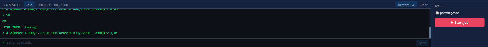

### Output Log

All messages from FluidNC arrive here in real time:

- WebSocket console output (includes `ok`, `error`, status reports)
- Serial data (same stream behaviour)
- Commands echoed as `> command`
- terraForge system messages in `[terraForge] …` format

### Sending Commands

Type any raw G-code or FluidNC command in the input field at the bottom and press **Enter** or click **Send**. Disabled when not connected.

### Status Indicator

The console header shows:

- **Machine state** badge (`Idle`, `Run`, `Hold`, `Alarm`, etc.)
- **Position** `X:0.00 Y:0.00 Z:0.00` (work coordinates)

### Alarm Handling

When the machine enters **Alarm** state, the state badge becomes a pulsing red button:

> **⚠ ALARM — click to unlock**

Click it to send `$X` (alarm clear / unlock). Use this after homing errors, limit-switch trips, or soft-limit violations.

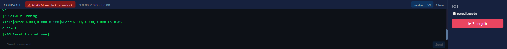

### Firmware Restart

The **⚠ Restart FW** button appears in the console header when connected. Use this only when the controller is stuck (e.g. frozen, unresponsive to commands):

1. Click **⚠ Restart FW**.
2. Confirm the dialog. terraForge sends `[ESP444]RESTART`, which reboots the ESP32.
3. The connection drops immediately. terraForge auto-disconnects.
4. Wait for the controller to finish booting (~5 seconds), then click **Connect**.

> ⚠️ **Note:** This is a hard reboot. Any running job will be aborted.

### Homing

Click **Home** in the toolbar (disabled when not connected) to send `$H` and run the FluidNC homing cycle. The machine moves to its home switches. Make sure the bed is clear before homing.

### Clear Console

Click **Clear** in the console header to wipe the output log.

---

## 14. Background Tasks

All long-running operations appear as **notifications** stacked in the top-right corner of the canvas.

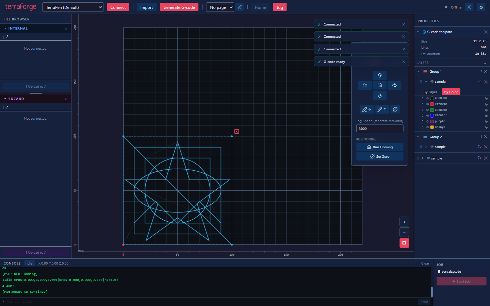

### Notification Anatomy

| Element              | Description                                               |
| -------------------- | --------------------------------------------------------- |
| **Spinner**          | Shown when progress % is unknown (indeterminate)          |
| **Progress bar + %** | Shown when progress is measurable                         |
| **✓ green**          | Task completed successfully                               |
| **✕ red**            | Task cancelled by user                                    |
| **! red**            | Task failed — error detail shown on a second line         |
| **✕ button**         | Cancel a running task, or dismiss a finished notification |

### Auto-dismiss

| Status    | Behaviour                                                          |
| --------- | ------------------------------------------------------------------ |
| Completed | Auto-dismissed after **8 seconds**                                 |
| Cancelled | Auto-dismissed after **8 seconds**                                 |
| Error     | **Never** auto-dismissed; must be manually dismissed by clicking ✕ |

### Cancellable Tasks

| Task              | Cancel mechanism                       |
| ----------------- | -------------------------------------- |
| G-code generation | Direct message to Web Worker (instant) |
| File upload       | IPC cancel via main process            |
| File download     | IPC cancel via main process            |

---

## 15. Layout Management & Page Templates

### Saving a Layout

A **layout** captures all your canvas work: imported SVGs, layer groups, positions, scales, rotations, the active page template, and the queued toolpath reference. Layouts are saved as `.tforge` JSON files.

Press **Ctrl+S** or choose **File → Save Layout**. A save dialog opens. Choose a location and filename.

> **Tip:** Save regularly while designing a complex multi-pen plot.

### Opening a Layout

Press **Ctrl+O** or choose **File → Open Layout**. Select a `.tforge` file. The current canvas is replaced with the saved state.

### Closing a Layout

Choose **File → Close Layout**. If you have imports on the canvas, a confirmation dialog appears before clearing.

### Page Templates

A page template overlays a paper-size boundary on the canvas as a visual guide for print-size artwork. The overlay is non-interactive and renders below your imports.

**Built-in page sizes:**

| Size    | Dimensions (portrait) |
| ------- | --------------------- |
| A2      | 420 × 594 mm          |
| A3      | 297 × 420 mm          |
| A4      | 210 × 297 mm          |
| A5      | 148 × 210 mm          |
| A6      | 105 × 148 mm          |
| Letter  | 215.9 × 279.4 mm      |
| Legal   | 215.9 × 355.6 mm      |
| Tabloid | 279.4 × 431.8 mm      |

Available options per template:

- **Landscape** — swap width and height.
- **Margin** — add an inset boundary inside the page outline.

**Page clip:** When a page template is active, G-code output can be clipped to the printable area (page minus margin) instead of the full machine bed.

**Custom page sizes:** Edit `page-sizes.json` in the app config directory. Choose **File → Open page sizes file** to open it in your system editor.

---

## 16. Keyboard Shortcuts

| Shortcut               | Action                                         |
| ---------------------- | ---------------------------------------------- |
| `Space` (hold)         | Enter pan mode; drag to pan                    |
| Middle-mouse drag      | Pan canvas                                     |
| Mouse wheel            | Zoom canvas (centred on cursor)                |
| `Ctrl`+`Shift`+`+`     | Zoom in                                        |
| `Ctrl`+`Shift`+`-`     | Zoom out                                       |
| `Ctrl`+`0`             | Fit bed to viewport                            |
| `Ctrl`+`A`             | Select all imports (cycles: all → first → all) |
| `Ctrl`+`Z`             | Undo last canvas change                        |
| `Ctrl`+`Shift`+`Z`     | Redo                                           |
| `Ctrl`+`C`             | Copy selected import                           |
| `Ctrl`+`X`             | Cut selected import                            |
| `Ctrl`+`V`             | Paste                                          |
| `Ctrl`+`I`             | Import SVG                                     |
| `Ctrl`+`O`             | Open layout                                    |
| `Ctrl`+`S`             | Save layout                                    |
| `Delete` / `Backspace` | Delete selected import or toolpath             |
| `Escape`               | Deselect everything                            |

> **Note:** Shortcuts are inactive when the cursor is in a text input.

---

## 17. Troubleshooting

### Connection Issues

**"Connection failed" notification:**

- Check that the FluidNC controller is powered and on the same Wi-Fi network.
- Try using the IP address instead of `fluidnc.local` (mDNS can be unreliable on some networks).
- For USB: check the serial port path; on Windows check Device Manager.

**Amber pulsing dot after connecting:**

- The HTTP connection succeeded but the WebSocket is not yet active.
- If it stays amber for more than 15 seconds, the WebSocket ping watchdog marks the connection dead.
- Try disconnecting and reconnecting. If the issue persists, check if your FluidNC firmware requires an explicit WebSocket port (`81` for older ESP3D builds).

**Machine goes offline mid-job:**

- terraForge detects the WebSocket drop after 15 seconds of no ping.
- The connection automatically attempts to reconnect with exponential back-off (starts at 3 seconds, doubles each attempt, caps at 60 seconds). Watch the connection indicator — it will cycling to “Connecting…” while retrying.
- If automatic reconnection does not succeed, click **Disconnect**, then **Connect** manually.

---

### SVG Import Issues

**"No paths found in SVG":**

- The SVG contains only `<text>`, `<image>`, `<use>`, or other non-geometric elements.
- Export your file from Inkscape/Illustrator with paths only ("Object to Path" in Inkscape).

**Import appears at wrong scale:**

- Your SVG uses `px`/unitless dimensions. terraForge assumes 96 DPI. If your source app uses a different DPI, add explicit `mm` units to the SVG `width`/`height` attributes.

**Paths are in the wrong position after import:**

- The SVG may use `transform` attributes that aren't being resolved correctly.
- Please report the file as a bug. terraForge resolves `translate`, `scale`, `rotate`, and `matrix` transforms on all ancestor elements.

---

### G-code Issues

**G-code generated but machine movement is offset:**

- Check that the **Origin** setting in your machine config matches your actual FluidNC configuration.
- Verify the **bed width/height** settings match the machine's travel.

**Pen not lifting between strokes:**

- Check your **pen type** and **pen up/down commands** in the machine config.
- For solenoids: try swapping up/down with the ⇕ Swap button.

**Very long rapids between strokes:**

- Use **Generate & optimise** to apply nearest-neighbour path reordering, which significantly reduces total rapid travel.

---

### Job Issues

**"Start job" button is greyed out:**

- Ensure the machine is connected.
- Ensure a G-code file is selected (highlighted blue) in the File Browser, or imported via Import G-code.

**Job stops unexpectedly with ALARM:**

- The machine has hit a soft or hard limit.
- Click the **⚠ ALARM — click to unlock** button in the console to send `$X`.
- Jog back to a safe position before re-running.

**File upload fails at start of local job:**

- The SD card may be full or not inserted.
- Check SD card status in the File Browser SDCARD section.

---

### Console Issues

**Console shows no output after connecting:**

- For Wi-Fi connections, console output arrives via WebSocket. If the WebSocket is still connecting (amber dot), wait a moment.
- Try sending a command (e.g. `?` for status) to prompt a response.

**Commands sent but no response:**

- Ensure the machine is not in **Alarm** state.
- Try clearing the alarm with `$X`, then resend.

---

_For bugs and feature requests, refer to the terraForge project repository._
